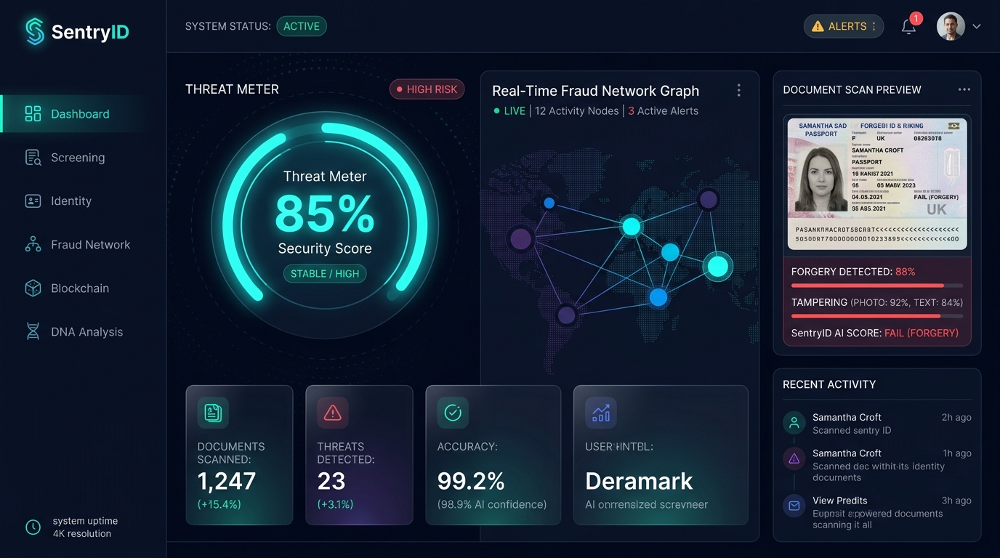
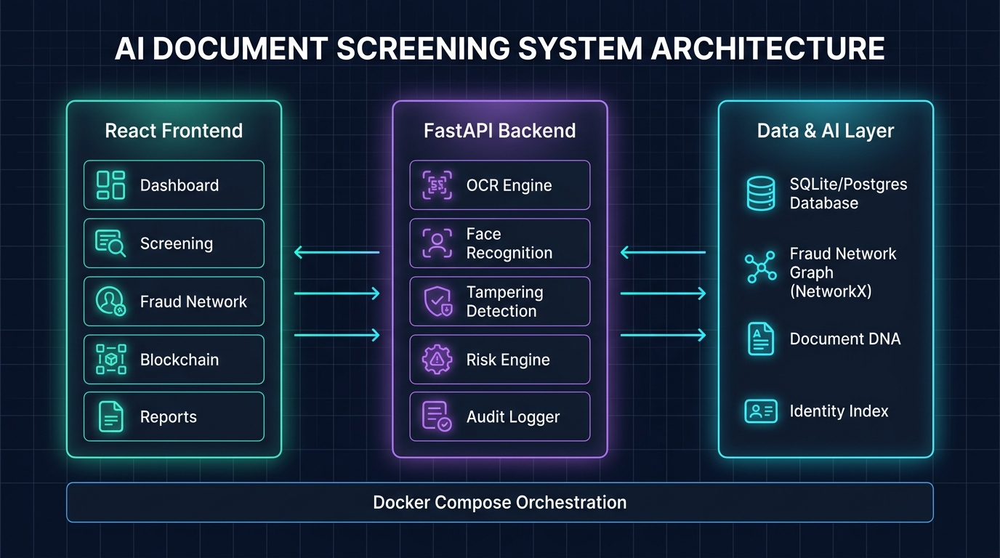

<div align="center">


# 🛡️ SentryID — AI-Based Fake Document Screening System

[](https://fastapi.tiangolo.com/)
[](https://react.dev/)
[](https://www.typescriptlang.org/)
[](https://www.python.org/)
[](https://docs.docker.com/compose/)
[](LICENSE)

**An enterprise-grade, AI-powered platform for real-time detection of forged, tampered, and fraudulent identity documents.**

[🚀 Live Demo](#-quick-start) · [📖 Documentation](#-api-documentation) · [🐛 Report Bug](https://github.com/roshancodingwala/AI-Based-Fake-Document-Screening-System/issues) · [💡 Request Feature](https://github.com/roshancodingwala/AI-Based-Fake-Document-Screening-System/issues)

</div>

---

## 🖥️ Dashboard Preview



> *Real-time threat monitoring with fraud network graph, document scan preview, and 99.2% AI-confidence scoring.*

---

## 🏗️ System Architecture



---

## ✨ Features

### 🤖 AI & Detection Engine
| Feature | Description |
|---|---|
| 📄 **OCR Analysis** | Extracts and validates text fields from passports, driver's licenses, and national IDs |
| 🖼️ **Tampering Detection** | Detects pixel-level alterations, splicing, and clone-stamp edits using OpenCV + deep learning |
| 👤 **Face Recognition** | Verifies facial consistency between document photo and live capture |
| 🧬 **Document DNA** | Unique fingerprinting of each document to detect duplicates across the system |
| 🕸️ **Fraud Network Graph** | NetworkX-powered graph that maps relationships between fraudulent actors and documents |
| ⛓️ **Blockchain Audit Trail** | Immutable, cryptographically-chained audit log of every screening action |
| 📊 **Risk Scoring Engine** | Multi-factor composite risk score per document with configurable thresholds |
| 🔁 **Cross-Checkpoint Matching** | Detects the same identity appearing at multiple geographic checkpoints |

### 🖥️ Frontend Pages
- **Dashboard** — Live KPIs, threat meter, fraud network, and recent activity
- **Document Screening** — Upload & scan documents with real-time AI analysis
- **Results** — Detailed per-document verdict with confidence breakdowns
- **Identity Management** — Search and manage known identities
- **Fraud Network** — Interactive graph visualization of linked fraud rings
- **Blockchain** — Browse the immutable audit chain
- **Document DNA** — Fingerprint database and duplicate detection
- **Cross-Checkpoints** — Multi-location activity tracker
- **Reports & Analytics** — Exportable reports with trend analysis
- **Alerts** — Real-time threat notification center
- **Self-Test** — Internal system health diagnostics
- **Settings** — Thresholds, model configs, and user preferences

---

## 🛠️ Tech Stack

### Backend (`sentry-id-backend`)
```
FastAPI 0.110+       → REST API framework
SQLAlchemy 2.0+      → ORM (SQLite default / Postgres-ready)
OpenCV (headless)    → Image processing & tampering detection
Pillow + NumPy       → Image analysis utilities
NetworkX             → Fraud relationship graph engine
Pydantic v2          → Schema validation
Uvicorn              → ASGI server
```

### Frontend (`fake-id-screening`)
```
React 18 + TypeScript  → UI framework
Vite                   → Build tool & dev server
TailwindCSS            → Utility-first styling
React Router v6        → Client-side routing
Recharts               → Data visualization
Lucide React           → Icon library
```

### Infrastructure
```
Docker + Docker Compose  → Containerized deployment
Nginx                    → Frontend reverse proxy
Vercel                   → Frontend hosting (vercel.json included)
```

---

## 🚀 Quick Start

### Option 1 — Docker (Recommended)

```bash
# Clone the repository
git clone https://github.com/roshancodingwala/AI-Based-Fake-Document-Screening-System.git
cd AI-Based-Fake-Document-Screening-System

# Copy and configure environment variables
cp sentry-id-backend/.env.example sentry-id-backend/.env

# Launch all services
docker-compose up --build
```

| Service | URL |
|---|---|
| 🖥️ Frontend | http://localhost:5173 |
| ⚙️ Backend API | http://localhost:8000 |
| 📖 Swagger Docs | http://localhost:8000/docs |

---

### Option 2 — Manual Setup

#### Backend

```bash
cd sentry-id-backend

# Create a virtual environment
python -m venv .venv
.venv\Scripts\activate        # Windows
# source .venv/bin/activate   # macOS/Linux

# Install dependencies
pip install -r requirements.txt

# Configure environment
cp .env.example .env          # edit as needed

# Start the server
uvicorn app.main:app --reload --port 8000
```

#### Frontend

```bash
cd fake-id-screening

# Install dependencies
npm install

# Start the dev server
npm run dev
```

---

### Option 3 — Windows Quick Launch

```powershell
# Run the provided start script (starts both services)
.\start.ps1
```

---

## 📁 Project Structure

```
AI-Based-Fake-Document-Screening-System/
├── fake-id-screening/              # React + TypeScript frontend
│   ├── src/
│   │   ├── pages/                  # All application pages (14 pages)
│   │   ├── components/             # Shared UI components
│   │   ├── lib/                    # Utilities & context
│   │   └── data/                   # Mock/seed data
│   ├── Dockerfile
│   ├── nginx.conf
│   └── vite.config.ts
│
├── sentry-id-backend/              # FastAPI Python backend
│   ├── app/
│   │   ├── routers/                # API route handlers (9 routers)
│   │   ├── services/               # Business logic & AI services (14 services)
│   │   ├── schemas/                # Pydantic request/response models
│   │   ├── db/                     # Database models, session & seeding
│   │   └── core/                   # Config, security & logging
│   ├── tests/
│   ├── Dockerfile
│   └── requirements.txt
│
├── docs/images/                    # Project screenshots & diagrams
├── docker-compose.yml
├── start.ps1                       # Windows quick-launch script
└── vercel.json                     # Vercel deployment config
```

---

## 📖 API Documentation

Once the backend is running, interactive API docs are available at:

- **Swagger UI** → [http://localhost:8000/docs](http://localhost:8000/docs)
- **ReDoc** → [http://localhost:8000/redoc](http://localhost:8000/redoc)

### Key Endpoints

| Method | Endpoint | Description |
|---|---|---|
| `POST` | `/screen/document` | Submit a document for full AI screening |
| `GET` | `/documents/` | List all screened documents |
| `GET` | `/fraud/network` | Get the fraud relationship graph |
| `GET` | `/risk/score/{doc_id}` | Get composite risk score for a document |
| `GET` | `/audit/chain` | Retrieve the blockchain audit trail |
| `POST` | `/face/verify` | Run face recognition verification |
| `GET` | `/identity/search` | Search the identity index |
| `GET` | `/intelligence/alerts` | Get active threat intelligence alerts |
| `GET` | `/health` | System health check |

---

## ⚙️ Environment Variables

Create `sentry-id-backend/.env` from the provided `.env.example`:

```env
APP_NAME=SentryID
ENVIRONMENT=development
SECRET_KEY=your-secret-key-here
DATABASE_URL=sqlite:///./sentry_id.db   # or postgresql://...
```

---

## 🧪 Running Tests

```bash
cd sentry-id-backend
pytest tests/ -v
```

---

## 🔮 Production Upgrade Path

The backend is architected for easy swap-in of real AI models. In each service file, look for the `# PRODUCTION SWAP-IN` comment:

| Service | Prototype | Production Model |
|---|---|---|
| OCR | Regex-based | PaddleOCR / Tesseract |
| Face Recognition | OpenCV | InsightFace / DeepFace |
| Tampering Detection | Histogram analysis | PyTorch fine-tuned CNN |
| Identity Index | SQLite linear scan | FAISS / Qdrant vector DB |

To enable, uncomment the relevant lines in `requirements.txt` and swap the service implementation.

---

## 🤝 Contributing

Contributions are welcome! Please follow these steps:

1. Fork the repository
2. Create a feature branch: `git checkout -b feature/amazing-feature`
3. Commit your changes: `git commit -m 'Add amazing feature'`
4. Push to the branch: `git push origin feature/amazing-feature`
5. Open a Pull Request

---

## 📄 License

This project is licensed under the MIT License — see the [LICENSE](LICENSE) file for details.

---

## ⚠️ Disclaimer

> This is a **prototype / research system**. All AI screening results are **simulated** unless real production models are integrated. All identity data used in demos is **entirely synthetic**. Do not use this system to make real-world identity or legal decisions without proper validation and certification.

---

<div align="center">

**Built with ❤️ by [roshancodingwala](https://github.com/roshancodingwala)**

⭐ If you found this helpful, please give it a star!

</div>
